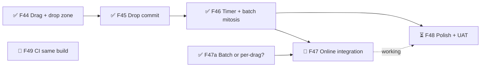

# Roll Better — Roadmap
Release target: not set — must:next 3/6 done (+6 milestones shipped before conversion)

## v1.0 — MVP  ✅ shipped 2026-03-03
## v1.1 — Online Multiplayer  ✅ shipped 2026-03-05
## v1.2 — Polish  ✅ shipped 2026-03-06
## v1.3 — Drop-in/Drop-out  ✅ shipped 2026-03-12
## v1.4 — Landscape  ✅ shipped 2026-03-26
## v1.5 — Hold-to-Gather-Roll  ✅ shipped 2026-03-27

## v1.6 — Drag-to-Unlock  ← current  (→ release stage not set)
Goal: players unlock by dragging locked dice into the rolling area — offline and online — with no UNLOCK/SKIP buttons.
Live now: v0.2.1 (hotfix 2026-09-28) has F44–F46 plus the core of F47.
- ✅ F44 🎮 Drag detection & drop zone — must:next
- ✅ F45 🎮 Drop commit & highlight state — must:next · needs: F44
- ✅ F46 🎮 Inactivity timer & batch mitosis — must:next · needs: F45
- ✅ F47a ❓ Decide online unlock messages: per-drag or one batch — Muzzy picked one batch per phone (TDD D15)
- 🔨 F47 🎮 Online play integration — must:next · needs: F46, F47a · sprint 1 (+B006)
  what: mostly done by hotfix v0.2.1 (online uses the same 3 s drag timer + one batched unlock_request; B003). Left:
  (1) clear stale committed (glowing) dice when the server ends the unlock phase before the phone does — `committedUnlocks` is only cleared by the phone's own mitosis;
  (2) the server's 25 s unlock backstop can cut off a player still dragging (each drag restarts the 3 s timer) and counts it as AFK — decide how the two timers meet; fix the stale "client 20 s + 5 s" comment;
  (3) server 12-die cap should match the client rule (client: pool + locked + unlocks ≤ 12; server: pool ≤ 12 — client is stricter, no desync today);
  (4) the server's AFK unlock still runs the old tap-select `handleConfirmUnlock` path — check it on screen;
  (5) 🙋 two-phone check of B003.
- ⏳ F48 ✨ Polish & UAT — must:next · needs: F46, ~F47
  what: 12-die cap feedback, drag near boundaries, fast multi-drag, drag feel tuning, full online + viewport UAT; fix B005 tip text
- 🔨 F49 🐞 CI builds the same way as local — must:next · sprint 1
  what: deploy workflow runs `npm run build` (type check included) instead of `npx vite build` — root cause of B004 staying hidden; 1 task

## Later
- ✨ Clearer unlock timer (last-second warning) — could · parked for the art redesign (Muzzy 2026-09-28)
- Watch: B001 (matching dice sometimes don't lock), B002 (dice cant against walls) — patched in v1.5, see BUGS.md
- 🔧 Dev Kit tools recommended by the TDD: Multiplayer (second player, lag/disconnect) before the next netcode sprint; Tuning (physics + timers → content/tuning); Bug capture
- Tutorial system rework — should (VISION #6)
- Full audio pass — should (VISION #7)
- Unlock/commit dice outline style — could (VISION #1)
- Return-to-icon animations — could (VISION #2)
- Mouse throw rolling on PC — could (VISION #5)
- Upgrades system: spots + special dice — could, needs a full design pass (VISION #9)
- Dice skins, tabletop textures, player profile art — could (VISION #10–#12)

## Ideas
- 2026-09-28 — Rest of the UI on the game-ui kit (Cartoon): main menu + online lobby first, then How to Play / Winners / countdown / tip banner, HUD last. Needs kit additions: game-box mode (16:9 frame), seat-claim list, labels pinned to 3D. Art question: bright Cartoon UI vs the dark table. Settings already done (kit 0.1.3).
