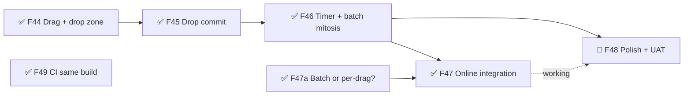
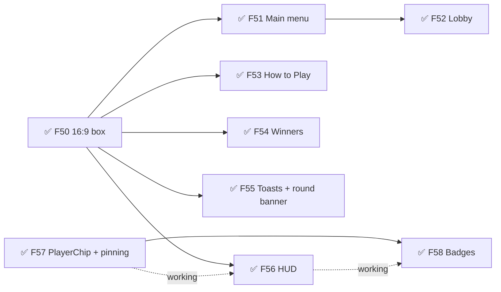
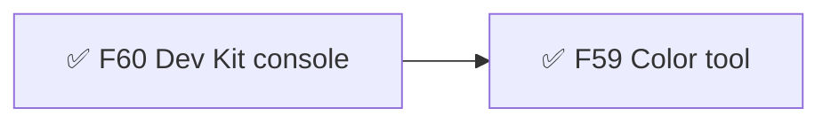

# Roll Better — Roadmap
Release target: 1.0 — musts not set yet (/define) · live stage: beta (Muzzy 2026-09-29: "probably Beta since the art isn't final")

## v1.0 — MVP  ✅ shipped 2026-03-03
## v1.1 — Online Multiplayer  ✅ shipped 2026-03-05
## v1.2 — Polish  ✅ shipped 2026-03-06
## v1.3 — Drop-in/Drop-out  ✅ shipped 2026-03-12
## v1.4 — Landscape  ✅ shipped 2026-03-26
## v1.5 — Hold-to-Gather-Roll  ✅ shipped 2026-03-27

## v1.6 — Drag-to-Unlock  ← current  (open: F48)  (→ release stage not set)
Goal: players unlock by dragging locked dice into the rolling area — offline and online — with no UNLOCK/SKIP buttons.
Live now: v0.3.0 (2026-09-29) — everything except F48.
- ✅ F44 🎮 Drag detection & drop zone — must:next
- ✅ F45 🎮 Drop commit & highlight state — must:next · needs: F44
- ✅ F46 🎮 Inactivity timer & batch mitosis — must:next · needs: F45
- ✅ F47a ❓ Decide online unlock messages: per-drag or one batch — Muzzy picked one batch per phone (TDD D15)
- ✅ F47 🎮 Online play integration — must:next · needs: F46, F47a · sprint 1 (+B006) · approved 2026-09-28
- 🔨 F48 ✨ Polish & UAT — must:next · needs: F46, ~F47 · sprint 5
  what: 12-die cap feedback, drag near boundaries, fast multi-drag, drag feel tuning, full online + viewport UAT; fix B005 tip text
- ✅ F49 🐞 CI builds the same way as local — must:next · sprint 1
  what: deploy workflow runs `npm run build` (type check included) instead of `npx vite build` — root cause of B004 staying hidden; 1 task

## v1.7 — Cartoon UI everywhere  ✅ released v0.3.0 (beta) 2026-09-29
Goal: every screen and on-table label uses the game-ui kit (Cartoon) — menus, lobby, How to Play, winners, HUD and player badges look like Settings/Credits; the dark table stays (Muzzy 2026-09-29, D19).
- ✅ F50 🧱 Kit screens sit inside the game's 16:9 box — should · sprint 2 · approved 2026-09-29
  what: kit screens/HUD use the game frame, not the letterbox bars; check first — may already be true
- ✅ F51 🎮 Main menu + Create/Join on the kit — should · needs: F50 · sprint 2 · approved 2026-09-29
  why: one look from the first screen → the game reads as one finished thing → trust (Fair forever, Zero friction)
- ✅ F52 🎮 Online room lobby + reconnecting on the kit — should · needs: F51 · sprint 2 · approved 2026-09-29
  what: kit Lobby (room) + Reconnecting; kit addition: seat-claim list for mid-game joins (built in the framework kit, then installed)
- ✅ F53 🎮 How to Play on the kit — should · needs: F50 · sprint 2 · approved 2026-09-29
- ✅ F54 🎮 Winners → kit Results / Post-game — should · needs: F50 · sprint 3 · approved 2026-09-29
  why: a big, readable finish → players see who won and hit Play Again → Fellowship
- ✅ F55 ✨ Tips + messages → kit toasts; round start → kit Countdown / Round intro — should · needs: F50 · sprint 3 · approved 2026-09-29
- ✅ F56 🎮 In-game HUD on the kit (status banner, round, timer bars, gear) — should · needs: F50, ~F57 · sprint 3 · approved 2026-09-29
  why: status and timers readable at a glance without pulling the eye off the dice → Sensation
- ✅ F57 🧱 New kit piece: labels pinned to 3D — should · sprint 3 · approved 2026-09-29
  what: an HTML card anchored to a 3D point that follows the camera/resize (drei Html); built in the Game Framework kit (dev/framework/ui-kit) as Built, then installed here
- ✅ F58 🎮 Player + Goal badges rebuilt as kit UI — should · needs: F57, ~F56 · sprint 3 · approved 2026-09-29
  what: kit Avatar + name + Score/Badge + start/turn, pinned beside each row; replaces the 3D profile groups (circle, star, "S2 | T2"). HTML draws above the table, so a badge fades while a dragged die passes over it (keeps the B010 promise: the die you hold is never hidden)
  why: who's who and who's ahead readable at a glance → Fellowship

## v1.8 — Dev Kit: colours first  ✅ released v0.3.0 (beta) 2026-09-29
Goal: Muzzy presses ` in the dev build, tweaks any UI or table colour with a picker, sees it live, and saves it into content/ — no more colour questions (Muzzy 2026-09-29: "fewer loops").
- ✅ F60 🧱 Dev Kit console — should · sprint 4 · approved 2026-09-29
  what: ` / triple-tap opens a right-side panel with tabs, dev build only (never live); Save writes content/ JSON through a dev-server endpoint; Copy for Claude. Built here, then moved to the shared Dev Kit (dev/tools/bmuz-devkit)
- ✅ F59 🔧 Dev Kit Color tool — should · needs: F60 · sprint 4 · approved 2026-09-29
  what: every kit style colour (content/ui/style.json tweaks over the Cartoon preset) + table colours (content/ui/table.json) with swatch, picker, reset; live preview incl. the 3D table; colour-blind preview toggle
  why: Muzzy tunes the look himself → fewer loops, faster taste calls

## Later
Old idea numbers (#1–#12) point to the full write-ups in `archive/vision.md`.
- ✨ Clearer unlock timer (last-second warning) — could · parked for the art redesign (Muzzy 2026-09-28)
- Watch: B001 (matching dice sometimes don't lock), B002 (dice cant against walls) — patched in v1.5, see BUGS.md
- 🔧 Dev Kit tools recommended by the TDD: Multiplayer (second player, lag/disconnect) before the next netcode sprint; Tuning (physics + timers → content/tuning); Bug capture
- Tutorial system rework — should (#6)
- Full audio pass — should (#7)
- Unlock/commit dice outline style — could (#1)
- Return-to-icon animations — could (#2)
- Mouse throw rolling on PC — could (#5)
- Upgrades system: spots + special dice — could, needs a full design pass (#9)
- Dice skins, tabletop textures, player profile art — could (#10–#12)

## Ideas
- 2026-09-29 — Dev Kit tabs next (Muzzy): **Spacing** (gaps/margins/radius from style.json), **Type** (fonts + sizes), game-specific **Tuning** tabs (e.g. power curves, timers, physics — content/tuning), a **Level loader**. And Dev Kit access on released builds — see the options discussed 2026-09-29 (test build vs passphrase; release can't Save to files; online fairness).
- 2026-09-29 — Colour-blind: with Deuteranopia, red (B1) and green (B3) player chips look nearly the same (Dev Kit Color tool preview). Initials still differ; consider a colour-blind-safe player palette or a shape/pattern per player.
