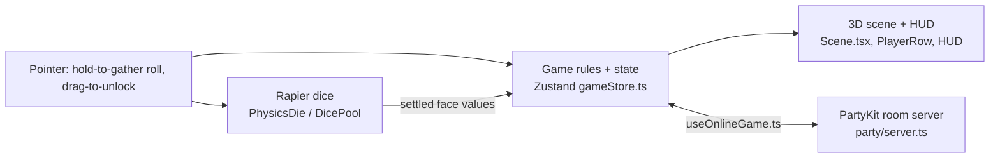

# Roll Better — Technical Design Document (TDD)

> How the game is built. Plain English first; code names in `backticks` only where they help.
> Living document — /define writes it, /develop keeps it true, /tdd shows it.
> Last updated: 2026-09-28 (slimmed to the BMUZ-2 shape; long detail moved to `design/tech-online.md` and `design/tech-internals.md`; facts re-checked against the code — the code won wherever docs disagreed)

## 1. At a glance
- **Platforms:** web — desktop + phone browsers, landscape only (since v1.4), installable PWA
- **Stack:** Vite 7 + TypeScript + React 19 + React Three Fiber 9 + Rapier physics + drei + Zustand 5 — why: real 3D physics dice in a browser, no install
- **UI:** Muzzy's game-ui kit from `dev/framework`, style Cartoon (`src/ui/kit`, `content/ui/`); Settings is the first screen on it. Update with `node ~/Documents/dev/framework/ui-kit/scripts/install-kit.mjs <this folder>`; never edit `src/ui/kit` here.
- **Where it runs online:** GitHub Pages (front end, auto-deploys on every push to `master`) + PartyKit room server on Cloudflare (`party/server.ts`, deployed by hand with `npx partykit deploy`)
- **Dev Kit tools used:** none yet. `content/tuning/scoring.json` is the first tweakable moved out of code; `content/text/en.json` holds screen words (v1.7); `content/data` is empty (catalog: `~/.claude/config/bmuz/DEVKIT.md`) — **recommended next:** **Multiplayer** (open a second player, simulate lag/disconnect — B003 hid for months because online wasn't tested every change), **Tuning** (physics + timer numbers → `content/tuning/`), **Bug capture** (online bugs are hard to describe from a phone).

## 2. How it fits together

- **Game state** — `src/store/gameStore.ts` (one Zustand store, ~1,370 lines): phases, players, locks, pool, animation queues, drag/commit state, online flags. Everyone reads it.
- **Physics dice** — `PhysicsDie.tsx` (one die: rigid body, settle, snap flat), `DicePool.tsx` (spawns the pool, waits for all dice to settle, reads faces), `RollingArea.tsx` (floor + walls).
- **Turn flow / glue** — `src/App.tsx` (~860 lines): phase effects, roll, unlock timer expiry, batch mitosis, online unlock submit. Most "what happens next" logic lives here, not in the store.
- **3D view** — `Scene.tsx` runs the goal row, player rows, pool and the animation dice (lock, mitosis, spawn, committed); the draggable locked die is `UnlockableDie` in `PlayerRow.tsx`; gather effects in `GatherVisuals.tsx`.
- **HUD** — `HUD.tsx`: status text + countdown bars (roll AFK, unlock inactivity).
- **UI kit screens** — `src/ui/`: `<ScreenStack overlay>` in App.tsx draws kit screens over the whole window; Settings rows come from `content/ui/settings.json`. Old page-wide CSS sits in `@layer game-base` so it can't reach kit parts.
- **Online** — phone side: `useOnlineGame.ts` (messages, buffered reveals, deferred snapshots, watchdog), `useRoom.ts` (lobby); server: `party/server.ts` (~2,000 lines); message types in `src/types/protocol.ts`.
- **Pure logic (tested)** — `src/utils/`: `matchDetection`, `aiDecision`, `unlockTurn`, `diceCap` (+ `.test.ts`); also `dropZone`, `diceUtils`.

**Golden rules** (the few architecture rules that must never be broken):
- R3F: never React state for per-frame updates — mutate refs in `useFrame`.
- Physics decides the dice. Values come from the settled die (`getFaceUp`), never a random number — offline and online.
- Online is an invisible layer: each player's own screen behaves exactly like offline; the server validates and relays, it never makes a human wait for another human.
- Every `phase_change` carries a full player snapshot (self-healing); apply it only after local animations finish (deferred snapshot, 5 s safety timeout).
- Other players' results stay hidden until you've acted (buffered reveals).

## 2b. Game-specific systems

**Multiplayer** — full detail (turn flow, all ~35 messages, seats, sync): [design/tech-online.md](design/tech-online.md)
- **Who's in charge:** each phone rolls its own dice and reports the values; the server works out the locks itself, checks unlocks, moves phases on when everyone has acted, runs the AFK backstops and bots, and owns rooms and seats.
- **Unlocking (D15/D16):** each phone runs its own 3 s drag timer, then sends ONE batched `unlock_request` (or `skip_unlock`); each drag also pings `unlock_activity` so the server never AFKs someone who's busy dragging.
- **12-dice cap:** pool + still-locked + 2 per unlocked die ≤ 12 — one shared helper, `src/utils/diceCap.ts`, used by phone and server.
- **Seats:** a per-tab id for the connection, a saved `persistentId` that owns the seat; rejoin gets a full snapshot; 2 auto-actions in a row → a bot takes the seat; host moves to the next active human.
- **Deploys:** pushing `master` updates only the front end. Server changes need `npx partykit deploy` by hand.

**Physics / simulation** — full number table, build notes: [design/tech-internals.md](design/tech-internals.md)
- Numbers are hardcoded today (gravity [0, -50, 0], die bounce 0.35, friction 0.5, damping 0.3) — first candidates for `content/tuning/physics.json`.
- **Settled** = every die slower than 0.5 after 500 ms of rolling (or asleep), with a 10 s give-up. **Results** are read from which face points up; a tilted die is snapped flat first.
- Locked dice are pictures, not physics objects — physics only runs in the rolling area.

**Timers** — every timer in one table, so two timers never fight:
| Timer | Length | Owned by | Starts when | On expiry |
|---|---|---|---|---|
| Roll AFK countdown | 20 s | client (`RollingCountdown`) | `idle`, online only | auto-roll / force-release gather, flagged `afk` |
| Roll backstop | 25 s (client's 20 s + 5 s margin) | server | first `roll_result` arrives (idle → rolling) | server auto-rolls non-responders |
| Gather auto-release | 2.5 s | client (`DicePool`) | holding to gather | dice released (roll) |
| Unlock inactivity | 3 s, restarts on every committed drag | client (HUD, offline + online) | `unlocking`, animations done | mid-drag die resolves by zone (commit / snap back), turn closed → mitosis; online: send one `unlock_request`/`skip_unlock` (D15). All synchronous in the tick's task — a drop is either in the snapshot or refused; leaving `unlocking` returns any parked die to its slot. Race sweep: `e2e/unlock-race-sweep.mjs` |
| Unlock backstop | 25 s (`UNLOCK_BACKSTOP_MS`); each `unlock_activity` tops it up to ≥ 10 s left (`UNLOCK_ACTIVITY_GRACE_MS`, D16), never past 45 s from the phase start (`UNLOCK_MAX_PHASE_MS`, hard limit) | server | unlocking phase starts | `autoSkipUnresponsivePlayers` → client gets an AFK unlock, played through the drag path (still counts toward AFK escalation) |
| Scoring pause | 2 s | server | round won (scoring) | handicap applied, next round |
| Round-end pause | 0.5 s | server | `roundEnd` | next round starts |
| Deferred snapshot safety | 5 s (checked every 100 ms) | client | `phase_change` held behind animations | force-apply |
| Watchdog | 1 s tick, 5 s stall | client | always online | `phase_sync_request`; 3 stalls → force `idle` |
| Disconnect grace | remaining roll/unlock backstop time (other phases: none) | server | player drops | seat → bot |
| Empty-room keepalive | 10 s | server | last connection closes | room closed |

## 3. Data the game reads (editable by Muzzy — in Obsidian or the Dev Kit)
| File | What's in it | Edited with |
|---|---|---|
| `content/tuning/*.json` | `scoring.json` (points per leftover die); physics + timer numbers (§2b) are next candidates | Dev Kit → Tuning |
| `content/anim/*.json` | (none) | Dev Kit → Animation |
| `content/text/en.json` | every player-facing word, one section per screen (menu, lobby, How to Play, credits so far — the rest move in as screens go onto the kit); loaded by `src/ui/words.ts` | Obsidian / Dev Kit → Text |
| `content/data/*.json` | (empty) | Dev Kit → Content tables |
| `content/ui/style.json` | UI kit look: `{ "preset": "cartoon", "tweaks": {} }` | Obsidian |
| `content/ui/settings.json` | Settings rows (audio, performance, tips, confirmation, unstick, leave game, privacy) | Obsidian |

## 4. Standards (so any engineer could pick this up)
- **Folders:** `src/components` (React + 3D views), `src/store` (state), `src/hooks` (online + input), `src/utils` (pure logic + tests), `src/types` (game + message types), `src/ui` (game-ui kit), `party/` (server), `e2e/` (browser check scripts), `public/` (privacy page, icons), `proto/` (Python balance sims), `content/` (data, empty so far). Old file-by-file map + state shape: [design/tech-internals.md](design/tech-internals.md).
- **Naming:** PascalCase components, camelCase utils, protocol messages snake_case (`unlock_request`).
- **Readable code:** plain names, small files, a one-line comment on anything non-obvious. No clever tricks. (App.tsx, gameStore.ts and server.ts are well past "small".)
- **Tests:** rules and logic get tests; every fixed bug gets a test that guards it. Feel is judged by Muzzy, not tests.
  - `npm test` — unit tests (vitest): `matchDetection`, `aiDecision`, `unlockTurn`, `diceCap`. Nothing yet for the store, App flow or server.
  - `npm run build` — `tsc -b && vite build` (type check + build). CI runs build + tests on every deploy since F49.
  - `npm run e2e` / `npm run e2e:solo` — scripts in `e2e/` play the real game in a headless browser (solo late drag; two-player online unlock). Not in CI. Details: [design/tech-internals.md](design/tech-internals.md#e2e-scripts-detail-for-tdd-4-tests).
  - Manual checks by hand: [design/playtest-checklist.md](design/playtest-checklist.md).
- **Testable by design:** game rules live in small pure functions (no screen, no network) so they can be tested; big glue files stay thin. (`unlockTurn.ts` is the pattern: the B003 rule pulled out of HUD/App so it could be tested.)
- **Same build everywhere:** the deploy (CI, `.github/workflows/deploy.yml`) runs the same `npm test` + `npm run build` as local, type check included (fixed in F49 — the old `npx vite build` is how B004 stayed hidden).
- **Branches:** one work branch per delivery (`dev/<milestone>`), merged by /deliver. ⚠ `master` auto-deploys to the live site — never build straight on it.

## 5. Budgets
| | Target | How it's checked |
|---|---|---|
| Frame rate | 60 fps on a mid-range phone | Dev Kit → Perf (not built; never measured) |
| First load | < 3 s on 4G; download < 3 MB (not measured yet) | /deliver quick check |
| Memory | no growth over a 10-minute session | Dev Kit → Perf (not built) |
| Network (online games) | ~1 message per player per phase (roll, unlock) + relays + ≤ 7 `unlock_activity` pings per turn; PartyKit/Cloudflare free tier (~100k requests/day) | server logs |

## 6. Security & fairness
- Clients report their own dice values (client-authoritative) — a cheater could fake rolls. Accepted: casual friends-with-room-codes game.
- The server works out locks itself (`findAutoLocks`), so a client can't lock dice that don't match; it checks unlock slot numbers and applies the same 12-dice cap as the phone (`diceCap.ts`).
- Secrets: API keys never in the repo or the built game; `.env` is gitignored. `VITE_PARTY_HOST` is not a secret.

## 7. Compliance & legal (general audience — not made for kids)
- [x] Privacy policy page (`public/privacy.html` — zero data collection)
- [ ] App store age rating questionnaire done honestly; do **not** tick "under 13" as a target age (web only today; old notes mention IARC 3+ — unverified)
- [ ] Google Play Data Safety form / Apple privacy labels match what the game really collects (n/a until a store release)
- [ ] Any analytics, ads or accounts → consent + privacy policy updated (EU/UK GDPR) (none today)
- [ ] Every font, sound, image and code library is licensed for commercial use (list in §9 — one to verify)
- [ ] Accessibility basics: readable text sizes, color not the only signal, reduced-motion respected (player colors are the main signal — unchecked)

## 8. Decisions log
Newest first. Every real "how should we build this" choice — including Muzzy's ideas.
```
D19 · 2026-09-29 · UI rollout: every screen on the game-ui kit; player badges become HTML pinned to 3D
  Proposed by: Muzzy (Cartoon over the dark table; rebuild badges as kit UI)   Options: restyle 3D badges in place / kit UI pinned to 3D / leave them
  Chose: kit UI pinned to 3D (drei Html anchored to each row) — standard nameplate pattern. HTML always draws above the canvas,
  so a badge fades while a dragged die passes over it. New kit pieces (pinned label, seat-claim list) are built in this game
  in dev/framework/ui-kit first (the game-ui rule: never edit the game's kit copy), then installed with install-kit. Every player-facing word goes to content/text/en.json as screens move.

D18 · 2026-09-28 · Scoring is a list in content/tuning/scoring.json: points for 0–4 leftover dice = 8, 6, 4, 2, 1
  Proposed by: Muzzy (new numbers — a 4-leftover win used to score 0)   Options: keep 8 − 2×leftover in code / a list in content
  Chose: one list, read by `src/utils/scoring.ts` on the phone, the star preview and the server — was copy-pasted in 3 places

D17 · 2026-09-28 · UI: game-ui kit, style Cartoon — Muzzy 2026-09-28; fits 'social by default' + 'juice everything'
  First screen: Settings (F07 try-out of the framework's game-ui skill). Kit screens go through <ScreenStack overlay>
  (the game isn't built from kit Screens and #root is a letterboxed 16:9 box, so the overlay covers the whole window).
D16 · 2026-09-28 · Unlock backstop vs the 3 s drag timer: each committed drag pings the server (unlock_activity)
  Proposed by: Claude (F47 task 4)
  Options: longer fixed backstop (turn can be ~7 windows × 3 s + lead-in ≈ 26 s, so 35 s+) /
  per-player deadline worked out from the cap / activity ping that tops the backstop up
  Chose: activity ping — on unlock_activity the server makes sure ≥ 10 s remain on the (room-wide) backstop.
  Why: an actively dragging player can never be AFK'd however many dice they drag, real AFK is still
  caught at 25 s, and it's one tiny message per drag (≤ 7 per turn). Cost: an active dragger can delay
  AFK detection of someone else by a few seconds. Revisit if the backstop becomes per-player.
D15 · 2026-09-28 · Online drag-to-unlock: each phone sends ONE batched unlock_request when its own inactivity timer ends
  Proposed by: Claude (hotfix B003); Muzzy suggested the alternative
  Options: server decides every player's unlocks itself at timer end / each phone owns its timer and sends one batch
  Chose: per-phone batch — Muzzy's decision (he approved it over his own server-decides idea). Why: your own dice never wait
  on a server round-trip and a drag near the deadline can't be lost; the server's 25 s backstop still catches real AFK.
  Revisit if we ever go server-authoritative for anti-cheat.
D14 · 2026-03-30 · Unlock inactivity timer 3 s, restarts on each drag; skip = don't drag (from GSD 46)
  (46-01 planned 4 s for the first window — the code is 3 s throughout)
D13 · 2026-03-30 · Drag commit is one-way; committed dice glow, then split together when the timer ends (batch mitosis, in place) (from GSD 45–46)
D12 · 2026-03-27 · Scoring = max(0, 8 − 2 × dice left in pool) (from GSD 43-01; old GDD §4.5 table is stale) — replaced by D18
D11 · 2026-03-10 · play_again message + auto-match old seat by persistentId (from GSD 32)
D10 · 2026-03-07 · Dual identity: conn.id (sessionStorage) per tab, persistentId (localStorage) owns the seat (from GSD 27)
D09 · 2026-03-07 · AFK: 2 consecutive auto-actions → bot takes the seat (from GSD 28)
D08 · 2026-03-05 · Snapshot sync on every phase change (from GSD)
D07 · 2026-03-04 · Buffered reveals — others' results hidden until you've acted (from GSD)
D06 · 2026-03-04 · Per-player relay, no batching — results go out as each player finishes (from GSD)
D05 · 2026-03-04 · Client-authoritative dice: each phone rolls its own physics, server validates + relays (from GSD)
  Options: server rolls / shared seed / client reports   Chose: client reports — keeps the dice feel real
D04 · 2026-03-05 · Static HTML privacy page — crawlable, no JS (from GSD)
D03 · 2026-02-28 · Zustand over Context/Redux — works with R3F without re-render cost (from GSD)
D02 · 2026-02-28 · MeshPhysicalMaterial + clearcoat + HDRI; Rapier over Cannon.js (from GSD)
D01 · 2026-03-06 · randomDifficulty() duplicated in client + server — PartyKit bundle limitation (from GSD, tech debt)
```
  2026-09-29 (pre-release review): the top-ups had no limit, so a client pinging every 9 s could hold the whole room in the unlock phase → added a 45 s hard limit per phase (a real turn is ≈ 26 s at most).

## 9. Third-party stuff
| What | Used for | License | OK for commercial? |
|---|---|---|---|
| three, @react-three/fiber, @react-three/drei | 3D rendering | MIT | yes |
| @react-three/rapier | physics wrapper | not stated in its package.json — verify (upstream repo is MIT) | verify |
| @dimforge/rapier3d-compat | physics engine | Apache-2.0 | yes |
| zustand, react, partykit, partysocket, vite-plugin-pwa | state, UI, online, PWA | MIT | yes |
| playwright-core (dev only) | e2e browser checks | Apache-2.0 | yes |
| drei `Environment preset="apartment"` | HDRI lighting (pmndrs CDN, Poly Haven source) | CC0 | yes |
| Sounds | procedural Web Audio stubs | own | yes |

## 10. Risks & open questions
- **Online unlock (ROADMAP F47, built, awaiting approval):** the old edge cases are handled in code — parked dice return to their slot when the phase ends, the activity ping (D16) stops the backstop cutting off a slow dragger, and phone + server share one cap rule. Still to prove on real phones in a live room.
- Big files (App.tsx, gameStore.ts, server.ts) make flow bugs hard to test — no seams for unit tests outside `utils/`.
- Rapier WASM on low-end phones — fps never measured (no Perf tool).
- PartyKit free tier (~100k requests/day) — fine for friends, unknown for a real launch.
