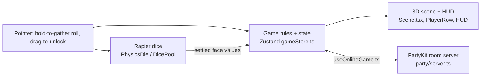

# Roll Better — Technical Design Document (TDD)

> How the game is built. Plain English first; code names in `backticks` only where they help.
> Living document — /define writes it, /develop keeps it true, /tdd shows it.
> Last updated: 2026-09-28 (created at the BMUZ-2 conversion from the old STATE Key Architecture, GDD §5.3/§5.4/§7, PROJECT.md decisions and a look at the code — the code won wherever docs disagreed)

## 1. At a glance
- **Platforms:** web — desktop + phone browsers, landscape only (since v1.4), installable PWA
- **Stack:** Vite 7 + TypeScript + React 19 + React Three Fiber 9 + Rapier physics + drei + Zustand 5 — why: real 3D physics dice in a browser, no install (old docs said React 18; `package.json` says 19 — code wins)
- **UI:** game-ui kit (src/ui/kit, content/ui/) — Muzzy's Game UI kit from `dev/framework`, style Cartoon; Settings is the first screen on it (`src/ui/SettingsScreen.tsx`). Update with `node ~/Documents/dev/framework/ui-kit/scripts/install-kit.mjs <this folder>`; never edit `src/ui/kit` here.
- **Where it runs online:** GitHub Pages (front end, auto-deploys on every push to `master`) + PartyKit room server on Cloudflare (`party/server.ts`, deployed by hand with `npx partykit deploy`)
- **Dev Kit tools used:** none yet. `content/tuning`, `content/text`, `content/data` folders exist but are empty — every tweakable is still hardcoded (catalog: `~/.claude/config/bmuz/DEVKIT.md`) — **recommended next:** **Multiplayer** (open a second player, simulate lag/disconnect — before any netcode sprint; B003 hid for months because online wasn't tested every change), **Tuning** (physics + timer numbers in §2b → `content/tuning/`), **Bug capture** (online bugs are hard to describe from a phone).

## 2. How it fits together

- **Game state** — `src/store/gameStore.ts` (one Zustand store, ~1,370 lines): phases, players, locks, pool, animation queues, drag/commit state, online flags. Everyone reads it.
- **Physics dice** — `PhysicsDie.tsx` (rigid body, settle + snapFlat), `DicePool.tsx` (spawns the pool, waits for all dice to settle, reads faces with `getFaceUp`), `RollingArea.tsx` (floor + walls).
- **Turn flow / glue** — `src/App.tsx` (~860 lines): phase effects, roll, unlock timer expiry, batch mitosis, online unlock submit. Most "what happens next" logic lives here, not in the store.
- **3D view** — `Scene.tsx` orchestrates goal row, player rows, pool and animation dice (`AnimatingDie`, `MitosisDie`, `SpawningDie`, `CommittedDie`); the draggable locked die is `UnlockableDie` inside `PlayerRow.tsx`; gather VFX in `GatherVisuals.tsx`.
- **HUD** — `HUD.tsx`: status text + countdown bars (idle/roll AFK, unlock inactivity).
- **UI kit screens** — `src/ui/` (game-ui kit): `<ScreenStack overlay>` in App.tsx draws kit screens over the whole window (z 80 via `--kit-overlay-z`); Settings rows from `content/ui/settings.json`, values wired to the store's settings. Old page-wide CSS (index.css, App.css `*` reset) sits in `@layer game-base` so it can't reach kit parts.
- **Online** — client: `useOnlineGame.ts` (messages, buffered reveals, deferred snapshots, watchdog), `useRoom.ts` (lobby); server: `party/server.ts` (~2,000 lines: rooms, seats, AFK, host migration, locking, unlock relay); message types in `src/types/protocol.ts`.
- **Pure logic (tested)** — `src/utils/matchDetection.ts`, `aiDecision.ts`, `unlockTurn.ts`, `diceCap.ts` (+ `.test.ts`); also `dropZone.ts`, `diceUtils.ts`.

**Golden rules** (the few architecture rules that must never be broken):
- R3F: never React state for per-frame updates — mutate refs in `useFrame`.
- Physics decides the dice. Values come from the settled die (`getFaceUp`), never a random number — offline and online.
- Online is an invisible layer: each player's own screen behaves exactly like offline; the server validates and relays, it never makes a human wait for another human.
- Every `phase_change` carries a full player snapshot (self-healing); apply it only after local animations finish (deferred snapshot, 5 s safety timeout).
- Other players' results stay hidden until you've acted (buffered reveals).

## 2b. Game-specific systems

**Multiplayer** (moved here from old GDD §5.3)
- **Who's in charge:** each phone rolls its own physics and reports values (client-authoritative dice); the server runs `findAutoLocks` itself (server-authoritative locking), validates unlocks, advances phases when everyone has acted, runs AFK backstops and bots, owns rooms/seats.
- **Rolling:** roll → your locks animate locally at once → `roll_result` to server → server relays `player_lock_result` to everyone else → others buffer it until they've locked themselves, then reveal with the profile-emerge animation → when all have rolled, `phase_change: unlocking`.
- **Unlocking (since v0.2.1, D15):** you drag dice; your own 3 s inactivity timer ends your turn → your mitosis plays locally → ONE `unlock_request` (all dragged slots) or `skip_unlock` → server validates, applies, relays `unlock_result` to others (buffered until they've submitted) → when all responded, `phase_change: idle`. Each committed drag also sends `unlock_activity` so the backstop never AFKs an active player (D16).
- **Turn end (F47/B006):** when the 3 s timer fires, a drag in progress resolves by zone (rolling zone → counts, parked at a clear spot; locked zone → snaps back), then the turn is closed — no new drags until the next unlock phase (`isUnlockTurnOpen` / `resolveDragRelease` in `unlockTurn.ts`). Leaving the unlock phase and `initRound` clear parked dice (`committedUnlocks`). A server AFK unlock for you goes through the same path: its slots become parked dice → the same batch mitosis.
- **12-dice cap:** pool + locked + 2 per unlock ≤ 12 — one shared helper (`src/utils/diceCap.ts`) used by the phone and the server.
- **Deferred snapshot:** a `phase_change` that arrives mid-animation is held, polled every 100 ms, applied when animations clear (5 s force-apply).
- **Watchdog:** 1 s heartbeat; stuck >5 s in `locking`/`scoring`/`roundEnd` → `phase_sync_request`; 3 stalls in a row → force `idle`.
- **Messages** — client → server: `join`, `leave`, `start_game`, `roll_result`, `unlock_request`, `skip_unlock`, `unlock_activity` (D16), `rolling_timeout`, `play_again`, `phase_sync_request`, `seat_claim`. Server → client: `connected`, `room_state`, `player_joined`, `player_left`, `error` (with `code`, e.g. `room_full`), `game_starting` (server-made goal values), `roll_results`, `player_lock_result`, `phase_change`, `round_start`, `unlock_result`, `scoring`, `session_end`, `phase_sync`, `rejoin_state`, `player_reconnected`, `seat_state_changed`, `seat_list`, `seat_claim_result`, `seat_takeover`, `play_again_ack`, `room_closed`.
- **Identity + seats:** `conn.id` (sessionStorage, per tab) for the socket; `persistentId` (localStorage) owns the seat. Seat states: `human-active` / `human-afk` / `bot`. Rejoin with the same id → `rejoin_state` full snapshot. Duplicate `persistentId` → old tab evicted (`connected_elsewhere`). Mid-game joiners claim bot seats at phase boundaries (first claim wins). Host migrates to the next active human; all-bot room → `room_closed`.
- **AFK:** 2 consecutive auto-actions → bot takes the seat.
- **What each deploy contains:** push to `master` → GitHub Actions builds the front end (with `VITE_PARTY_HOST`) → Pages. Server changes need `npx partykit deploy` by hand — a front-end release does NOT update the server.

**Physics / simulation** (hardcoded today — candidates for `content/tuning/physics.json`)
| Parameter | Value | Notes |
|---|---|---|
| Gravity | [0, -50, 0] | faster than real — punchy |
| Mass | 1 | |
| Floor / wall restitution | 0.5 / 0.3 | |
| Friction | 0.6 | |
| Angular damping | 0.3 | 46-03 tried more damping, reverted |
| Die size / bevel | 0.589 / 0.07 | bevel is critical for the premium look |
| Settled | active check: speed < 0.5 after 500 ms of rolling (46-03), else Rapier sleep; 200 ms fallback; 10 s absolute timeout (ISS-005) | |
| Reading results | `getFaceUp` dot-products face normals vs up; dot < 0.95 → `snapFlat` rotates the die flat; walls nudge out 0.2 u on settle (B001/B002 patches) | |

**Build notes** (from old GDD §7.3 — still true)
- Locked dice are visual only (not physics objects); physics runs only in the rolling area.
- Roll impulse is applied at an offset point (not the center of mass) plus random spin, so dice tumble naturally.
- `Die3D.tsx` makes pip geometry + material once at module level, shared by every die.
- DicePool keys are `${generation}-${i}`; the generation bumps when the pool shrinks so dice remount with the right faces.
- React StrictMode double-fires effects in dev: init logic must be idempotent; `hasFired` refs prevent duplicate callbacks.

**State shape** (moved from old GDD §5.4 — partly stale: e.g. `selectedForUnlock` belongs to the old tap-to-unlock, and drag state `dragUnlockState` / `committedUnlocks` / `unlockTimerResetKey` is missing. `src/types/game.ts` + `gameStore.ts` are the truth.)
```
GameState {
  // Navigation
  screen: 'menu' | 'lobby' | 'game' | 'winners'
  phase: 'lobby' | 'rolling' | 'locking' | 'unlocking' | 'idle' | 'scoring' | 'roundEnd' | 'sessionEnd'

  // Game
  players: Player[]
  currentRound: number
  sessionTargetScore: number         // Default 20

  // Round state
  roundState: {
    goalValues: number[8]            // Sorted ascending
    rollResults: number[] | null
    rollNumber: number
    lastLockCount: number
    roundScore: number
    lockAnimations: LockAnimation[]
    unlockAnimations: UnlockAnimation[]
    aiLockAnimations: LockAnimation[]
    aiUnlockAnimations: AIUnlockAnimation[]
    poolExiting: boolean
    poolSpawning: boolean
    goalTransition: 'none' | 'exiting' | 'entering'
  }

  // Player shape
  Player {
    id: string
    name: string
    color: string                    // Hex color from curated palette
    isAI: boolean
    isHost: boolean
    poolSize: number                 // Dice in rolling pool
    lockedDice: (number | null)[8]   // 8 slots, null if empty
    startingDice: number             // Z value
    score: number                    // Total session points
    selectedForUnlock: boolean[8]    // Toggle state during unlock phase
    isReady: boolean                 // Lobby ready state
  }

  // Settings
  settings: {
    audioVolume: number              // 0–100
    performanceMode: 'advanced' | 'simple'
    hapticsEnabled: boolean
    tipsEnabled: boolean
    confirmationEnabled: boolean
  }

  // Online
  isOnlineGame: boolean
  isOnlineHost: boolean
  onlinePlayerId: string | null
  onlinePlayerIds: string[]          // Maps server IDs to local player indices
  pendingLockReveals: PlayerLockResultData[]
  pendingUnlockReveals: UnlockRevealData[]
  hasSubmittedUnlock: boolean
}
```

**Timers** — every timer in one table, so two timers never fight:
| Timer | Length | Owned by | Starts when | On expiry |
|---|---|---|---|---|
| Roll AFK countdown | 20 s | client (`RollingCountdown`) | `idle`, online only | auto-roll / force-release gather, flagged `afk` |
| Roll backstop | 25 s | server | rolling phase starts | server auto-rolls non-responders |
| Unlock inactivity | 3 s, restarts on every committed drag | client (HUD, offline + online) | `unlocking`, animations done | mid-drag die resolves by zone (commit / snap back), turn closed → mitosis; online: send one `unlock_request`/`skip_unlock` (D15). All synchronous in the tick's task — a drop is either in the snapshot or refused; leaving `unlocking` returns any parked die to its slot. Race sweep: `e2e/unlock-race-sweep.mjs` |
| Unlock backstop | 25 s; each `unlock_activity` tops it up to ≥ 10 s left (D16) | server | unlocking phase starts | `autoSkipUnresponsivePlayers` → client gets an AFK unlock, played through the drag path (still counts toward AFK escalation) |
| Deferred snapshot safety | 5 s | client | `phase_change` held behind animations | force-apply |
| Watchdog | 1 s tick, 5 s stall | client | always online | `phase_sync_request` |
| Disconnect grace | remaining phase time (non-timed phases: none) | server | player drops | seat → bot |
| Empty-room keepalive | 10 s | server | last connection closes | room closed |
| Gather auto-release | 2.5 s | client | holding to gather | dice released (roll) |


## 3. Data the game reads (editable by Muzzy — in Obsidian or the Dev Kit)
| File | What's in it | Edited with |
|---|---|---|
| `content/tuning/*.json` | (empty — nothing extracted yet; §2b numbers are the first candidates) | Dev Kit → Tuning |
| `content/anim/*.json` | (none) | Dev Kit → Animation |
| `content/text/en.json` | (empty — player text lives in the components) | Obsidian / Dev Kit → Text |
| `content/data/*.json` | (empty) | Dev Kit → Content tables |
| `content/ui/style.json` | UI kit look: `{ "preset": "cartoon", "tweaks": {} }` | Obsidian |
| `content/ui/settings.json` | Settings rows (audio, performance, tips, confirmation, unstick, leave game, privacy) | Obsidian |

## 4. Standards (so any engineer could pick this up)
- **Folders:** `src/components` (React + R3F views), `src/store` (state), `src/hooks` (online + input hooks), `src/utils` (pure logic + tests), `src/types` (game + protocol types), `party/` (server), `public/` (privacy.html, icons), `proto/` (Python balance sims), `content/` (data, empty so far).
- **Project structure** (moved from old GDD §7.2 — partly stale: `LobbyScreen`, `GravityController`, `useAccelerometerGravity` were removed; `CommittedDie`, `GatherVisuals`, `gatherPoints.ts`, `dropZone.ts`, `unlockTurn.ts` are missing):
```
src/
├── main.tsx                         # App entry point
├── App.tsx                          # Screen router, phase effects, game event handlers
├── App.css                          # All styles
├── index.css                        # Base styles
│
├── store/
│   └── gameStore.ts                 # Zustand store — all game state + actions
│
├── types/
│   ├── game.ts                      # GamePhase, Player, RoundState, LockAnimation, etc.
│   └── protocol.ts                  # WebSocket message types (client ↔ server)
│
├── components/
│   ├── MainMenu.tsx                 # Offline setup: player count, difficulty, play button
│   ├── LobbyScreen.tsx              # Online: room code, player list, ready, start (merged into MainMenu inline flow)
│   ├── WinnersScreen.tsx            # Final rankings, play again, menu
│   ├── HUD.tsx                      # Status text, roll/unlock/skip buttons, AFK countdown
│   ├── Settings.tsx                 # Audio, performance, haptics, tips toggles
│   ├── HowToPlay.tsx                # In-game rules reference modal
│   ├── TipBanner.tsx                # Contextual tutorial hints
│   ├── RollingCountdown.tsx         # AFK countdown bar (rolling + unlock phases)
│   ├── TouchIndicator.tsx           # Visual touch feedback
│   │
│   ├── Scene.tsx                    # Main R3F canvas — orchestrates all 3D components
│   ├── RollingArea.tsx              # Physics arena: floor + 4 walls
│   ├── DicePool.tsx                 # Pool management, physics dice, settle detection
│   ├── PhysicsDie.tsx               # Single physics die: rigid body + settle events
│   ├── Die3D.tsx                    # 3D die visual: RoundedBox + pip dots
│   │
│   ├── GoalRow.tsx                  # 8 Goal dice with entry/exit animations
│   ├── GoalIndicators.tsx           # Colored wedges under Goal showing player locks
│   ├── GoalProfileGroup.tsx         # Star icon + score display (far left of Goal)
│   │
│   ├── PlayerRow.tsx                # One player's 8 lock slots + icon
│   ├── PlayerIcon.tsx               # Color swatch + score + X/Y/Z
│   ├── PlayerProfileGroup.tsx       # AI/other player icon (scaled, positioned)
│   │
│   ├── AnimatingDie.tsx             # Lock animation: pool → slot lerp
│   ├── MitosisDie.tsx               # Unlock animation: slot → 2 dice arc to pool
│   ├── SpawningDie.tsx              # Pool spawn animation: icon → pool position
│   └── GravityController.tsx        # Accelerometer-based gravity tilt
│
├── hooks/
│   ├── useOnlineGame.ts             # Server message listener, phase sync, watchdog, buffering
│   ├── useRoom.ts                   # Lobby: room creation/joining, game start detection
│   └── useAccelerometerGravity.ts   # Tilt-based gravity for rolling dice
│
└── utils/
    ├── matchDetection.ts            # findAutoLocks() — pure logic (7 unit tests)
    ├── matchDetection.test.ts       # Unit tests for match detection
    ├── aiDecision.ts                # AI unlock strategies (Easy/Medium/Hard)
    ├── aiDecision.test.ts           # Unit tests for AI decisions
    ├── diceUtils.ts                 # getFaceUp(), getFaceUpRotation()
    ├── diceCap.ts                   # 12-dice unlock cap — shared by phone + server (tested)
    ├── partyClient.ts               # PartySocket wrapper
    ├── soundManager.ts              # Web Audio API sound effects
    └── haptics.ts                   # Vibration API wrapper
```
- **Naming:** PascalCase components, camelCase utils, protocol messages snake_case (`unlock_request`).
- **Readable code:** plain names, small files, a one-line comment on anything non-obvious. No clever tricks. (App.tsx, gameStore.ts and server.ts are well past "small".)
- **Tests:** rules and logic get tests (`npm test` → vitest); every fixed bug gets a test that guards it. Feel is judged by Muzzy, not tests. Tested today: `matchDetection`, `aiDecision`, `unlockTurn`, `diceCap` — nothing for the store, App flow or server (the e2e scripts below cover the unlock flow).
- **E2E checks (scripts, `e2e/`):** real game in headless system Chrome (`playwright-core`, `channel: 'chrome'`), drags driven through the real store actions. Each script starts its own servers and kills them when done (Vite `:5199`, PartyKit `:2999` — not 1999, so a normal `npm run party:dev` can keep running; the scripts refuse to start if a port is taken). Exit code 0 = PASS.
  - `npm run e2e:solo` → `e2e/solo-late-drag.mjs` (~1 min): B006 — drag over the locked zone at timer end snaps back, a drag right after the timer is refused, nothing left parked; drag over the rolling zone at timer end counts (pool +2, clear spot).
  - `npm run e2e:online` → `e2e/online-unlock.mjs` (~1 min): two players, one room — a held drag counts at timer end (ONE `unlock_request`, not AFK, plus `unlock_activity`), no new drag after the turn closes, the other player hears it and both agree on the dice.
  - `npm run e2e` runs both. Needs Google Chrome installed. Not in CI yet.
- **Testable by design:** game rules live in small pure functions (no screen, no network) so they can be tested; big glue files stay thin. (`unlockTurn.ts` is the pattern: the B003 rule pulled out of HUD/App so it could be tested.)
- **Same build everywhere:** the deploy (CI) should run the same `npm run build` as local, type check included. ⚠ Today `.github/workflows/deploy.yml` runs `npx vite build`, which skips `tsc` — that's how B004 stayed hidden. Follow-up: ROADMAP F49.
- **Branches:** one work branch per delivery (`dev/<milestone>`), merged by /deliver. ⚠ `master` auto-deploys to the live site — never build straight on it.

## 5. Budgets
| | Target | How it's checked |
|---|---|---|
| Frame rate | 60 fps on a mid-range phone | Dev Kit → Perf (not built; never measured) |
| First load | < 3 s on 4G; download < 3 MB (not measured yet) | /deliver quick check |
| Memory | no growth over a 10-minute session | Dev Kit → Perf (not built) |
| Network (online games) | ~1 message per player per phase (roll, unlock) + relays; PartyKit/Cloudflare free tier (~100k requests/day) | server logs |

## 6. Security & fairness
- Clients report their own dice values (client-authoritative) — a cheater could fake rolls. Accepted: casual friends-with-room-codes game.
- Server runs `findAutoLocks` itself, so a client can't lock dice that don't match; it validates unlock slot indices and caps unlocks with the phone's rule (pool + locked + 2 per unlock ≤ 12, `diceCap.ts`).
- Secrets: API keys never in the repo or the built game; `.env` is gitignored. `VITE_PARTY_HOST` is not a secret.

## 7. Compliance & legal (general audience — not made for kids)
- [x] Privacy policy page (`public/privacy.html` — zero data collection)
- [ ] App store age rating questionnaire done honestly; do **not** tick "under 13" as a target age (web only today; old notes mention IARC 3+ — unverified)
- [ ] Google Play Data Safety form / Apple privacy labels match what the game really collects (n/a until a store release)
- [ ] Any analytics, ads or accounts → consent + privacy policy updated (EU/UK GDPR) (none today)
- [ ] Every font, sound, image and code library is licensed for commercial use (list in §9 — one to verify)
- [ ] Accessibility basics: readable text sizes, color not the only signal, reduced-motion respected (player colors are the main signal — unchecked)

## 8. Decisions log
Newest first. Every real "how should we build this" choice — including Muzzy's ideas.
```
D17 · 2026-09-28 · UI: game-ui kit, style Cartoon — Muzzy 2026-09-28; fits 'social by default' + 'juice everything'
  First screen: Settings (F07 try-out of the framework's game-ui skill). Kit screens go through <ScreenStack overlay>
  (the game isn't built from kit Screens and #root is a letterboxed 16:9 box, so the overlay covers the whole window).
D16 · 2026-09-28 · Unlock backstop vs the 3 s drag timer: each committed drag pings the server (unlock_activity)
  Proposed by: Claude (F47 task 4)
  Options: longer fixed backstop (turn can be ~7 windows × 3 s + lead-in ≈ 26 s, so 35 s+) /
  per-player deadline worked out from the cap / activity ping that tops the backstop up
  Chose: activity ping — on unlock_activity the server makes sure ≥ 10 s remain on the (room-wide) backstop.
  Why: an actively dragging player can never be AFK'd however many dice they drag, real AFK is still
  caught at 25 s, and it's one tiny message per drag (≤ 7 per turn). Cost: an active dragger can delay
  AFK detection of someone else by a few seconds. Revisit if the backstop becomes per-player.
D15 · 2026-09-28 · Online drag-to-unlock: each phone sends ONE batched unlock_request when its own inactivity timer ends
  Proposed by: Claude (hotfix B003); Muzzy suggested the alternative
  Options: server decides every player's unlocks itself at timer end / each phone owns its timer and sends one batch
  Chose: per-phone batch — Muzzy's decision (he approved it over his own server-decides idea). Why: your own dice never wait
  on a server round-trip and a drag near the deadline can't be lost; the server's 25 s backstop still catches real AFK.
  Revisit if we ever go server-authoritative for anti-cheat.
D14 · 2026-03-30 · Unlock inactivity timer 3 s, restarts on each drag; skip = don't drag (from GSD 46)
  (46-01 planned 4 s for the first window — the code is 3 s throughout)
D13 · 2026-03-30 · Drag commit is one-way; committed dice glow, then split together when the timer ends (batch mitosis, in place) (from GSD 45–46)
D12 · 2026-03-27 · Scoring = max(0, 8 − 2 × dice left in pool) (from GSD 43-01; old GDD §4.5 table is stale)
D11 · 2026-03-10 · play_again message + auto-match old seat by persistentId (from GSD 32)
D10 · 2026-03-07 · Dual identity: conn.id (sessionStorage) per tab, persistentId (localStorage) owns the seat (from GSD 27)
D09 · 2026-03-07 · AFK: 2 consecutive auto-actions → bot takes the seat (from GSD 28)
D08 · 2026-03-05 · Snapshot sync on every phase change (from GSD)
D07 · 2026-03-04 · Buffered reveals — others' results hidden until you've acted (from GSD)
D06 · 2026-03-04 · Per-player relay, no batching — results go out as each player finishes (from GSD)
D05 · 2026-03-04 · Client-authoritative dice: each phone rolls its own physics, server validates + relays (from GSD)
  Options: server rolls / shared seed / client reports   Chose: client reports — keeps the dice feel real
D04 · 2026-03-05 · Static HTML privacy page — crawlable, no JS (from GSD)
D03 · 2026-02-28 · Zustand over Context/Redux — works with R3F without re-render cost (from GSD)
D02 · 2026-02-28 · MeshPhysicalMaterial + clearcoat + HDRI; Rapier over Cannon.js (from GSD)
D01 · 2026-03-06 · randomDifficulty() duplicated in client + server — PartyKit bundle limitation (from GSD, tech debt)
```

## 9. Third-party stuff
| What | Used for | License | OK for commercial? |
|---|---|---|---|
| three, @react-three/fiber, @react-three/drei | 3D rendering | MIT | yes |
| @react-three/rapier | physics wrapper | not stated in its package.json — verify (upstream repo is MIT) | verify |
| @dimforge/rapier3d-compat | physics engine | Apache-2.0 | yes |
| zustand, react, partykit, partysocket, vite-plugin-pwa | state, UI, online, PWA | MIT | yes |
| drei `Environment preset="apartment"` | HDRI lighting (pmndrs CDN, Poly Haven source) | CC0 | yes |
| Sounds | procedural Web Audio stubs | own | yes |

## 10. Risks & open questions
- **Online unlock edge cases after the hotfix** (ROADMAP F47): committed dice aren't cleared if the server ends the phase first; the 25 s backstop can cut off a slow dragger; client and server use different 12-die cap rules (client: pool + locked + unlocks ≤ 12; server: pool ≤ 12 — client is stricter, so no desync today). Spike: two-browser test with local PartyKit.
- CI skips the type check (F49) — a broken `npm run build` can go live unnoticed.
- Big files (App.tsx, gameStore.ts, server.ts) make flow bugs hard to test — no seams for unit tests outside `utils/`.
- Rapier WASM on low-end phones — fps never measured (no Perf tool).
- PartyKit free tier (~100k requests/day) — fine for friends, unknown for a real launch.
